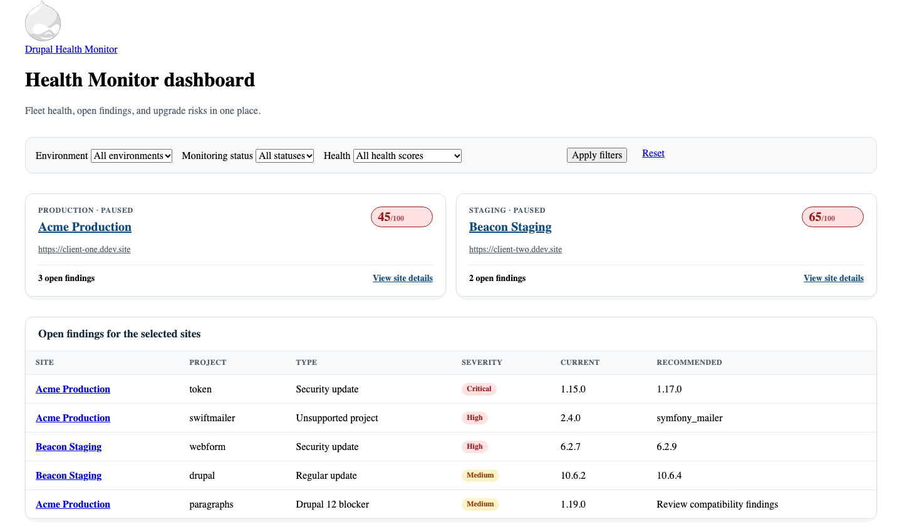
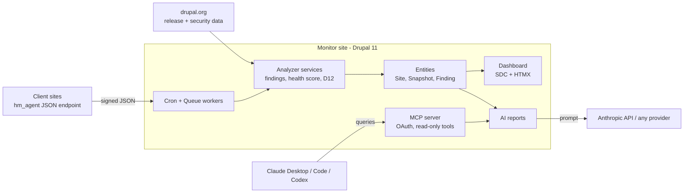

# Drupal Health Monitor

[](https://github.com/FLoRyN1994/DrupalHealthMonitor/actions/workflows/ci.yml)
[](LICENSE.txt)

> A fleet dashboard for Drupal maintenance retainers: core/module versions, security
> updates, Drupal 12 readiness and uptime for every client site, with AI-written client
> reports and an MCP server so you can ask Claude about your fleet.



**Live:** [health-monitor.tofdev.com](https://health-monitor.tofdev.com) · The
dashboard itself is authenticated because it contains operational client data.

## Why

Freelancers and agencies running Drupal maintenance retainers juggle updates and security
advisories across many sites by hand. Health Monitor collects a signed snapshot from each
client site, flags security updates, unsupported versions and Drupal 12 blockers with
deterministic PHP, and turns the findings into a plain-English report. See
[`docs/BLUEPRINT.md`](docs/BLUEPRINT.md) for the full scope, architecture diagram and
why this differs from Warden, Status Dashboard and Upgrade Status.

## What it does

- **Fleet dashboard** with a 0–100 health score per site, severity-ordered findings,
  and HTMX filters by environment, monitoring status, and health.
- **Signed collection**: a core-only agent on each client site exposes module, core,
  and PHP versions over an HMAC-signed endpoint; the monitor polls it from cron and
  records every attempt as uptime history.
- **Deterministic analysis** against drupal.org release data: security updates,
  unsupported versions, regular updates, and Drupal 12 blockers (including optional
  [Upgrade Status](https://www.drupal.org/project/upgrade_status) scan results).
- **AI client reports** persisted as versioned entities; PHP computes the effort
  estimate and the model only writes prose from verified evidence.
- **MCP server** so Claude Desktop, Claude Code, or Codex can query the fleet with
  four least-privilege tools.
- **One-command install** through a Drupal recipe with demo content, plus a Docker
  image that deploys to Railway.

## Architecture


```mermaid
flowchart LR
  CS[Client sites<br/>hm_agent JSON endpoint] -->|signed JSON| Q
  DO[drupal.org<br/>release + security data] --> AN
  subgraph M[Monitor site - Drupal 11]
    Q[Cron + Queue workers] --> AN[Analyzer services<br/>findings, health score, D12]
    AN --> EN[Entities<br/>Site, Snapshot, Finding]
    EN --> DB[Dashboard<br/>SDC + HTMX]
    EN --> AR[AI reports]
    MCP[MCP server<br/>OAuth, read-only tools] --> AR
  end
  AR -->|prompt| AI[Anthropic API / any provider]
  CL[Claude Desktop / Code / Codex] -->|queries| MCP
```

Two codebases live in one repo: the **monitor** (`hm_core`, the dashboard) and a
small, core-only **agent** (`hm_agent`) installed on each client site. Agent requests
use a five-minute HMAC signature window. Detection and effort calculations are
deterministic PHP; AI is used only to turn verified evidence into client-ready prose.

## Setup

Requirements: [Docker](https://docs.docker.com/get-docker/) and
[DDEV](https://ddev.readthedocs.io/en/stable/users/install/ddev-installation/).

From a fresh checkout:

```bash
ddev start
ddev composer install
ddev drush site:install minimal --site-name="Drupal Health Monitor" \
  --account-name=admin --account-pass=admin -y
ddev drush recipe ../recipes/health_monitor -y
ddev demo-sites
```

Open a one-time login directly on the dashboard:

```bash
ddev drush uli /admin/health-monitor/dashboard
```

The recipe can be reapplied safely and is the one-command setup for an installed
Drupal site:

```bash
ddev start && ddev drush recipe ../recipes/health_monitor -y
```

It installs the monitor, theme, AI/MCP/OAuth stack, least-privilege configuration,
and two paused demo sites with representative snapshots and findings. `ddev
demo-sites` provisions two independent local Drupal clients, creates their HMAC
secrets outside Git, and activates them. Set `ANTHROPIC_API_KEY` in the environment
to generate AI reports; the deterministic dashboard and MCP read tools work without
it.

## MCP demo

The MCP endpoint is `https://YOUR-HOST/mcp/post`. Simple OAuth protects it with a
dedicated `MCP Client` role and the `health_monitor:mcp` scope; the broad tools from
the contributed MCP module are disabled.

To connect a client:

1. Create a dedicated Drupal user at `/admin/people/create` and assign only the
   **MCP Client** role.
2. Add a confidential consumer at `/admin/config/services/consumer/add`. Enable the
   `client_credentials` grant, select the `health_monitor:mcp` scope, associate the
   dedicated user, and store the client ID and secret in your client secret store.
3. Exchange those credentials at `/oauth/token`, then send the bearer token with
   JSON-RPC requests to `/mcp/post`.

For example, list the deliberately small tool surface from a shell with `curl` and
`jq`:

```bash
export HM_BASE_URL=https://health-monitor.ddev.site
export HM_MCP_CLIENT_ID='replace-me'
export HM_MCP_CLIENT_SECRET='replace-me'

HM_MCP_TOKEN="$(curl --silent --show-error --fail \
  --user "${HM_MCP_CLIENT_ID}:${HM_MCP_CLIENT_SECRET}" \
  --data 'grant_type=client_credentials' \
  "${HM_BASE_URL}/oauth/token" | jq --raw-output '.access_token')"

curl --silent --show-error --fail \
  --header "Authorization: Bearer ${HM_MCP_TOKEN}" \
  --header 'Content-Type: application/json' \
  --data '{"jsonrpc":"2.0","id":1,"method":"tools/list","params":{}}' \
  "${HM_BASE_URL}/mcp/post" | jq
```

The server exposes exactly four application tools:

- `list_sites` — fleet health score and open-finding counts
- `get_site_findings` — evidence for one site
- `get_security_updates` — fleet-wide security work and deterministic effort
- `generate_site_report` — create a versioned AI report for one site

Ask an MCP client: **“Which client sites need security updates this week, and how
many hours in total?”** Against the included demo data it answers that **Acme
Production and Beacon Staging need work: two security updates, estimated at 5.5
hours total**, grounded in `get_security_updates` rather than model guesswork.

## Security model

- **Signed agent requests.** HMAC-SHA256 over the timestamp and request path with a
  five-minute, past-only window. Secrets live in the Key module and environment
  variables, never in exported configuration or Git.
- **Hostile-input hardening.** The monitor never follows redirects (so signed
  headers cannot be forwarded elsewhere), reads remote bodies with a hard size cap
  (2 MB from agents, 5 MB from drupal.org), accepts only `http`/`https` site URLs,
  and validates every project name from an agent payload before using it.
- **Least privilege.** Public registration creates a blocked account that an
  administrator must activate; the resulting operator role carries one permission.
  The MCP endpoint is OAuth-protected (`client_credentials`) with a dedicated role.
- **Evidence-conservative findings.** An unreachable release feed or incomplete
  agent payload never clears an existing alert.

## Data lifecycle

Cron queues one check per active site every five minutes and skips sites whose
previous check is still pending, so a slow client cannot make the queue grow without
bound. Uptime rows are kept for 90 days and snapshots for 30 days (each site's newest
snapshot is always kept). Deleting a site removes its snapshots, findings, reports,
and uptime history, and a client that still owns sites cannot be deleted.

## Development

```bash
ddev exec bash -c 'export SIMPLETEST_DB=mysql://db:db@db/db && \
  vendor/bin/phpunit -c web/core web/modules/custom'   # unit + kernel tests
ddev exec vendor/bin/phpstan analyse                    # static analysis
ddev exec vendor/bin/phpcs                              # Drupal coding standards
ddev composer audit --locked                            # known advisories
```

GitHub Actions runs all four, validates `composer.json`, and builds the production
Docker image on every pull request.

| Path | Contents |
| --- | --- |
| `web/modules/custom/hm_core` | The monitor: entities, collection, analysis, dashboard, reports, MCP tools |
| `web/modules/custom/hm_agent` | Core-only agent for client sites (Drupal `^10.3 \|\| ^11`) |
| `web/themes/custom/hm_theme` | Theme with Single Directory Components |
| `recipes/health_monitor` | Repeatable install recipe with demo content |
| `docker/`, `scripts/` | Production image, nginx config, Railway deploy scripts |
| `docs/`, `documentation/` | Blueprint, progress log, architectural decisions, per-milestone notes |

## Status

The six-milestone MVP is complete and deployed: custom operational entities, signed
agent collection, queues and uptime history, drupal.org analysis, Drupal 12
readiness, health scoring, an HTMX/SDC dashboard, versioned AI reports,
OAuth-protected MCP tools, a repeatable recipe, CI, and Railway deployment. A
follow-up audit (M13) hardened remote requests, fixed finding ordering and dashboard
caching, added data retention and integrity rules, and expanded the test suite.

See [`docs/PROGRESS.md`](docs/PROGRESS.md) for the implementation history and
[`docs/DECISIONS.md`](docs/DECISIONS.md) for the architectural record.

## What I'd do next

- Alert on new critical findings and downtime (email, Slack, or webhook).
- Show 30/90-day uptime percentages and health-score history per site.
- Check SSL certificate and domain expiry during each probe.
- Add a client-facing, role-scoped read-only portal.
- Generate and schedule monthly PDF maintenance reports.
- Let operators acknowledge or snooze findings with a reason and expiry.
- Collect Lighthouse performance and accessibility scores.
- Ingest Composer audit results for PHP dependency vulnerabilities.
- Port to Drupal 12 when it ships and publish the migration notes.

## License

[GPL-2.0-or-later](LICENSE.txt), same as Drupal.
